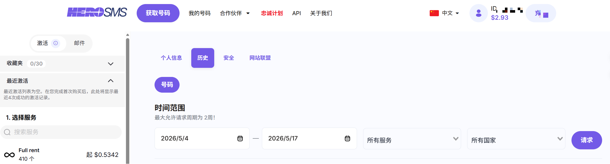
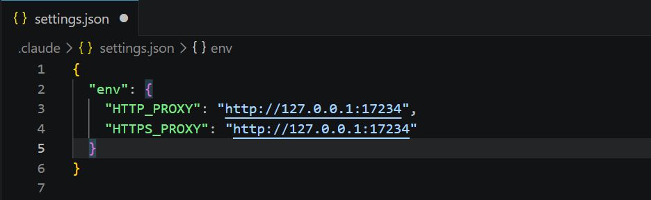
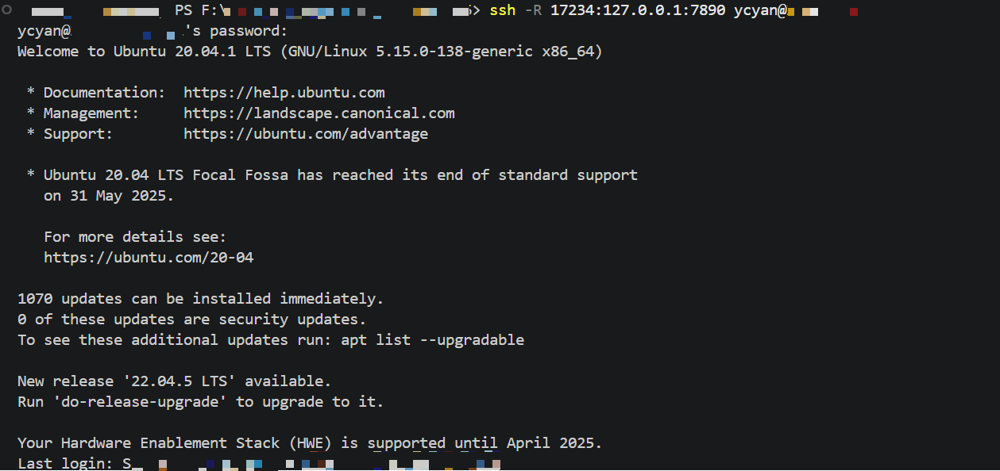
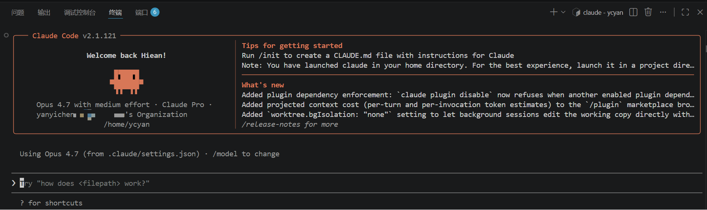
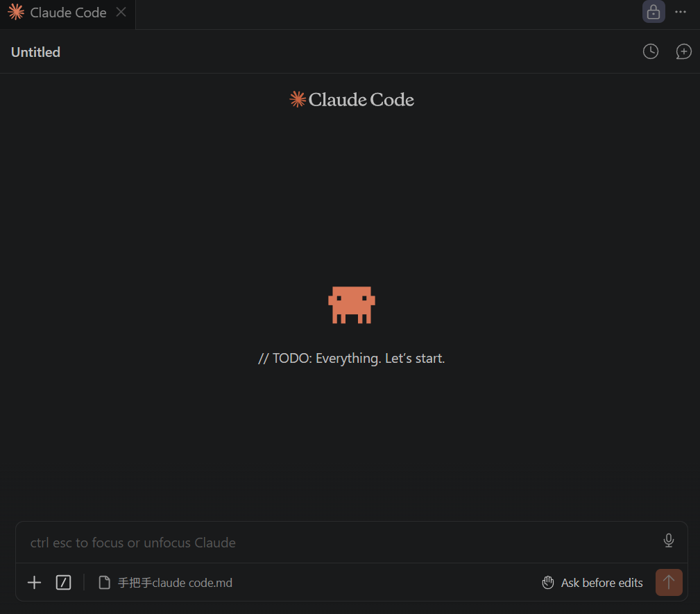

# 1. 注册账户
Claude官网：https://claude.com/product/claude-code

注册需要海外手机号，用于接收验证码，可用：https://hero-sms.com/cn

# 2. 购买Claude Pro
https://upclaude.com/

# 3. 连接上服务器后，开始配置（建议在vscode上）
## 1. 安装Claude Code，依次执行以下命令
### 1. 安装 nvm（不需要 root 权限）
curl -o- https://raw.githubusercontent.com/nvm-sh/nvm/v0.40.1/install.sh | bash

### 2. 加载 nvm
source ~/.bashrc

### 3. 用 nvm 安装 Node.js（自带 npm）
nvm install --lts

### 4. 确认安装成功
node -v
npm -v

### 5. 安装 Claude Code
npm install -g @anthropic-ai/claude-code

## 2. 确保成功登录的准备（依然连接着服务器，建议在vscode上）
### 1. 打开 ~/.claude.json
在大括号内末尾补充（用于**跳过login禁令**） ： 

"hasCompletedOnboarding": true

注意**逗号和保存**

### 2. 编辑或新增 ~/.claude/settings.json
内容如下，设17234为自己指定的**某个任意端口**，后面要用

可以顺便在 ~/.claude/CLAUDE.md 中(针对设定系统提示词)
简单的加一句 **Always reply in Chinese**.

### 3. 通过 SSH 隧道把本地 Clash(或其他梯子) 的代理端口转发到远程服务器上,使得能在远程服务器上连接Claude Code
启动**本地** Clash

确认本地 Clash 的端口（HTTP Port）：一般是 7890

在**本地的终端上**执行：

ssh -R 17234:127.0.0.1:7890 your_name@远程服务器地址

该命令中的 17234 **和前面的端口设定统一**，7890 即为**本地 Clash 端口**

输入服务器密码后，现在远程服务器就能借助本地 Clash 科学上网**连接上 Claude Code** ~

# 4. 正式登录
在前面的准备后，确认**本地Clash启动**，且执行了代理**端口转发**，用vscode连接上**远程服务器**，在**远程终端**执行：

claude login

选择使用Pro用户登录，会跳转网站授权，**一口气**成功能使用 Claude Code 的 CLI

# 5. 最后一步
在vscode上安装Claude Code官方扩展：Claude Code for VS Code

正常登录后即可使用可视化的聊天框~ Begin your Vibe coding！

# 6.总结后续在服务器上使用 Claude Code 的流程
以下流程执行顺序不固定~：

打开本地 Clash

在本地的终端上执行：
ssh -R 17234:127.0.0.1:7890 your_name@远程服务器地址

vscode连接远程服务器，进入项目目录,vscode右侧点击图标打开 Claude Code ~

